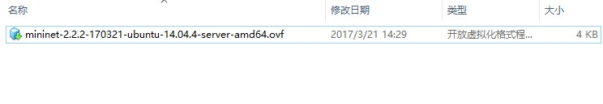

# Mininet简介及安装
## Mininet简介
Mininet用于在笔记本或者其他PC上创建一个即时的虚拟网络环境，只需一个简单的命令（命令详情见后文）即可快速的在一台机器（虚拟机、云服务器或本机）创建一个运行真实内核、交换机和其他应用代码的真实虚拟网络环境。使用Mininet的命令行接口（或API）可以快捷的与虚拟网络进行交互（定制网络环境、与他人共享或部署到实际硬件机器）。同时Mininet也是开发、共享和试验OpenFlow和SDN系统的绝佳方法。

官网：http://mininet.org/
## 下载和安装
最简单的安装方式是下载一个提前打包好的 Mininet/Ubuntu 虚拟机。这个虚拟机包含了Mininet、所有预装的OpenFlow二进制文件和工具，并且调整了内核配置以支持更大的Mininet网络。
### 下载及安装步骤：
1. 下载Mininet虚拟机镜像：https://github.com/mininet/mininet/releases 选择所需版本进行下载（本文档基于mininet-2.2.2-170321-ubuntu-14.04.4-server-amd64.zip
）。

注：图中“Assets”中为下载资源，图中“.sha256”后缀的文件为对应文件的sha256值文件，“amd64.zip”表示Ubuntu虚拟机为64位，“i386.zip”表示Ubuntu虚拟机为32位，最后两项为源码文件。
2. 安装一个虚拟化软件，本文档基于VMware Workstation。
3. 打开VMware Workstation，依次选择“文件”-->“打开”-->选择解压目录中的“.ovf”文件-->选择安装路径-->"导入"，即可安装完成。如下图：

## 系统使用
上两节已经对mininet进行了介绍并且安装成功，本节对mininet基本使用进行介绍。
### 系统基本介绍
由于使用的是mininet提供的打包好的虚拟机，因此只需在VMware Workstation中启动虚拟机即可。如下图：

虚拟机默认用户名：mininet

虚拟机默认密码：mininet

登陆后界面如下：

注：登陆进入后跟普通ubuntu系统的使用是一致的。

**设置root用户密码：使用`sudo passwd root` 命令可为root用户设置密码。**
### 远程连接
使用`ifconfig`命令查看网卡信息，如下：

使用远程连接工具，连接上图中的eth0网卡即可进行远程操作。
### mininet目录结构简介
使用默认用户mininet进入系统后在该用户的家目录会看到mininet的安装目录有及其他工具目录。本节介绍mininet目录下几个重要的目录。
1. mininet/bin/ ： 目录中只有一个“mn”文件，是mininet执行文件。
2. mininet/util/ : 内有多个子目录以及文件，主要存储一些工具脚本。
3. mininet/custom/ ： 目录中有两个文件：README和一个后缀为“.py”的脚本文件，脚本文件定义了一个网络拓扑（示例），本目录用于存储自定义网络的脚本文件。
4. mininet/examples/ ： 该目录从存放了很多官方提供的mininet示例脚本。

