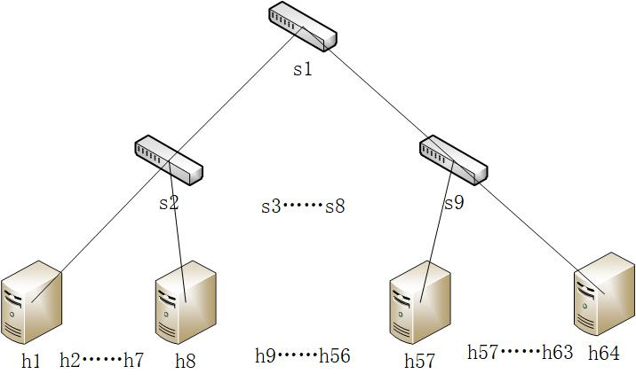
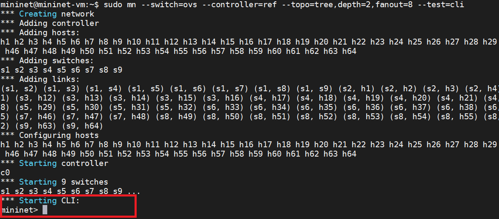
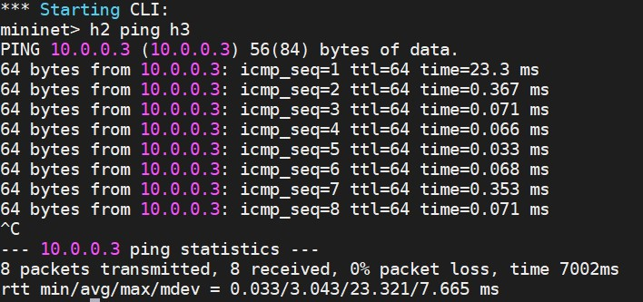
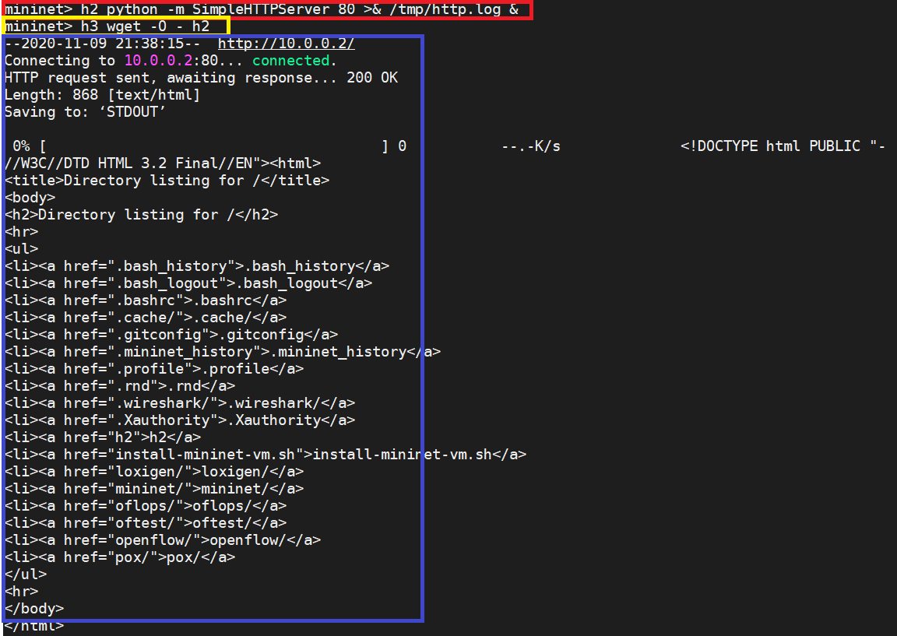
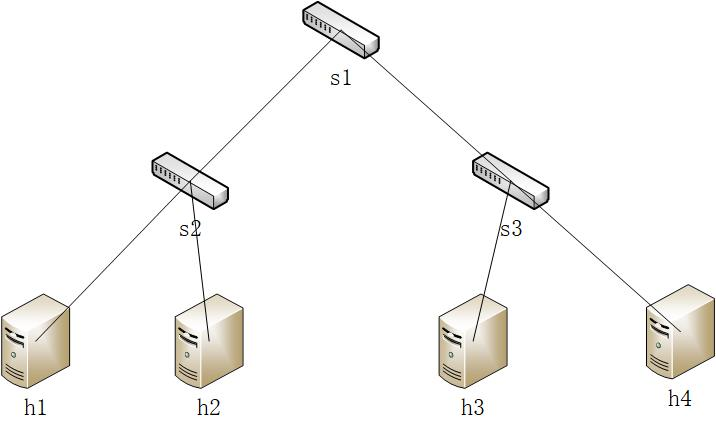
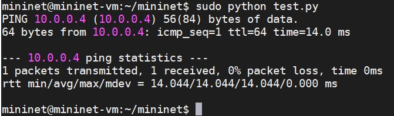

# mininet使用样例
通过Mininet可以快速的创建、交互、定制和分享SDN原型并且提供流畅的硬件部署流程。上一篇文章已经对mininet进行了介绍并且安装成功，本文对mininet使用样例进行简单介绍。
## mininet创建一个网络
通过简单的命令即可创建一个网络，例如：

`sudo mn --switch=ovs --controller=ref --topo=tree,depth=2,fanout=8 --test=pingall`

**功能：** 创建具有层数为2并且有8个输出的树形拓扑图（9台交换机和64台主机）的网络，它使用由OpenFlow/Stanford reference controller控制的Open vSwitch交换机，该网络运行`pingall`程序来检查所有节点之间的连通性。

**网络拓扑图：**


**命令选项说明：**
1. `sudo mn` ：执行命令需要使用root权限。
2. `--switch=ovs` ： 交换机类型为ovs（OVSSwitch）。
3. `--controller=ref` ： 控制器类型为ref（OpenFlow/Stanford reference controller）。
4. `--topo=tree,depth=2,fanout=8` ： 拓扑类型为tree（TreeTopo，树形拓扑），层数为2，每个节点有8个子节点，因此一个有9台交换机，64台主机。
5. `--test=pingall` ： 测试方式为pingall
## 与虚拟网络交互
通过mininet的命令行接口，可以通过一个控制台控制和管理整个虚拟网络。
### 使用主机 h2 ping h3
1. 使用对上一条命令的修改格式（将`--test`项修改为`cli`）可以打开控制台，命令如下：
`sudo mn --switch=ovs --controller=ref --topo=tree,depth=2,fanout=8 --test=cli`
效果图如下：

2. 在控制台使用命令`h2 ping h3`即可实现使用主机h2 ping h3，效果如下：

### 访问服务器
在上面只是测试两台机器之间的连通性，实际上**任何可用的Linux命令和程序代码都可在虚拟主机上执行**。下面在主机h2上建立HTTP服务器，使用主机h3作为客户端进行访问。
1. 创建虚拟网络。使用命令`sudo mn --switch=ovs --controller=ref --topo=tree,depth=2,fanout=8 --test=cli`创建虚拟网络。
2. 建立HTTP服务器。在网络控制台使用命令`h2 python -m SimpleHTTPServer 80 >& /tmp/http.log &`在主机h2创建监听80端口的服务器程序。
3. 客户端访问HTTP服务器。使用命令`h3 wget -O - h2`即可在h3机器上使用`wget`命令访问h2的HTTP服务器。如下图所示：

注：图中红色框为创建HTTP服务器的命令，黄色框为请求HTTP服务器，蓝色框为请求结果。
## 定制虚拟网络
使用Python命令调用Mininet提供的API可以创建定制的网络。
1. 创建py脚本文件，内容如下。
``` python
from mininet.net import Mininet
from mininet.topolib import TreeTopo

tree4 = TreeTopo(depth=2,fanout=2)    #树形拓扑信息
net = Mininet(topo=tree4)             #根据网络拓扑创建网络环境
net.start()                           #开启网络
h1, h4  = net.hosts[0], net.hosts[3]  #赋值
print h1.cmd('ping -c1 %s' % h4.IP()) #输出命令执行信息
net.stop()                            #关闭网络
```
网络拓扑图：


2. 运行脚本文件，即可创建虚拟网络并实现主机h1 ping 主机h2，并输出ping的信息,如下图：
