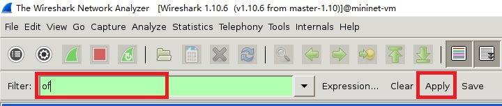

# mininet基础使用
## 显示启动选项
`sudo mn -h`
## 启动Wireshark
可以使用 Wireshark 来查看 OpenFlow 的控制信息。

**步骤：** 
1. 在命令行执行命令`sudo wireshark &`。“&”表示在后台运行Wireshark。启动过程中会报错如下图（由root用户启动导致，点击“ok”忽略该错即可）：
2. 启动成功如下图：
3. 在“Filter”框中输入`of`(OpenFlow)，点击后方的“Apply”按钮，即指定锅炉捕获的包中OpenFlow协议的包，如下图。
4. 选择`lo`网卡作为抓包网卡。
    * 方法一： 在Wireshark选项框中选择“Capture”按钮，然后在下拉框中选择“Interface”按钮。在弹出的窗口中选中`lo`，然后点击“Start”按钮即可开始抓包。如下：
    * 方法二： 在Wireshark主界面的左侧框中的“Interface List”选项中选择`lo`网卡或者在下方的滚动框中直接选择“Loopback:lo”网卡。然后点击“Start”按钮即可开始抓包。如下：
5. 在Mininet虚拟机中执行`mn`相关命令（例如：`sudo mn`开启一个最简单的网络环境）即可在Wireshark中看到OpenFlow控制信息包。
## 与虚拟网络中的主机和交换机进行交互
首先使用`sudo mn`命令开启一个最小化拓扑图和CLI的网络。

**说明：**
* 默认的网络为`minimal`拓扑的，该拓扑包含一个OpenFlow内核的交换机连接到两台主机和一个OpenFlow reference 控制器，共四台机器。这个拓扑也可以通过命令行选项`--topo=minial`来指定，还有其他拓扑图可以指定，可以使用`mn -h`命令输出信息中的`--topo`部分查看。minimal拓扑如下图：
* 没有指定`--test`项的参数，默认是`CLI`也就是命令行接口模式。
* 命令执行后，在上一步的Wireshark中会看到交换机连接到控制器的连接。

当前四台机器（两个主机、一个交换机、一个控制器）运行在一台虚拟机中。后续会介绍将控制器挪出虚拟机。

常用mininet CLI命令：
* `help`：显示Mininet CLI命令。
* `nodes`：显示所有节点。
* `net`：显示所有连接链路。
* `dump`：显示节点信息。

如果在Mininet CLI中输入的第一个字符串是一个主机、交换机或控制器名字，那么后面的命令会在该机器上执行。
* `h1 ifonfig -a`：在主机h1上执行“ifconfig -a”命令，并返回输出结果。（下图中的“h1-eth0”在宿主机操作系统中使用“ifconfig”命令不可见，因为他被指定到该主机的网络命名空间（namspace）中）

* `s1 ifconfig -a`：与在主机不同，交换机默认是运行在root的网络命名空间（namespace）上，所以在交换机执行命令与在宿主机的SHELL中是一样的。

将各个主机、交换机和控制器分别放到各自独立的网络命名空间（namespace）也是可以的，但是除非是为了复制一个复杂的多控制器网络，在其他情况下没有任何好处。Mininet支持这种操作，详见`--innamespace`选项。

注意：只有网络是虚拟的，每一个主机进程使用的是同一个进程集合和目录。例如分别在主机、交换机和宿主机执行`ps -a`命令，会打印相同的信息。（可以通过Linux容器的方式使用独立的进程命名空间（namespace），但是Mininet并没有这样做。因为将所有的机器运行在一个进程命名空间里更便于使用`ps`和`kill`命令进行调试）。分别输出的进程信息如下：
## 测试主机间连通性
依旧使用mininal拓扑类型的网络，首先检查host0与host1之间的连通性：`h1 ping -c 1 h2`。

注：如果出现在命令后的字符串是一个节点名，那么这个节点名会被替换为对应的IP地址。

**ping命令产生的OpenFlow控制流（使用前面介绍的Wireshark抓包查看）：**
1. 主机1通过ARP搜寻主机2的MAC地址，该动作导致一个`packet_in`消息发送到控制器。
2. 控制器会发送一个`packet_out`消息将广播数据包发送到交换机其他端口（本例中就是另一个主机也就是主机2的端口）。
3. 主机2收到ARP请求并发送ARP响应。这个响应发送到控制器，控制器再将响应发送到主机1并生成一个流实体（流表项）。
4. 至此，主机1知道了主机2的MAC地址，可以通过ICMP Echo请求发送它的ping。这个请求以及来自主机2相应的响应都会进入控制器，随着实际数据包被发送出去产生新的流实体（流表项）。

在第一次`ping`命令执行后再重复执行一次，会发现第二次`ping`比第一次耗费更少的时间（小于100us）。因为经过第一次ping命令，交换机中已经有覆盖ICMP流量的流实体（流表项），所以没有产生控制流量，数据包可以直接通过交换机。

## 运行一个简单的web服务器和客户端
Mininet主机可以运行任何在基础Linux系统和文件系统中可以执行的命令和应用程序。下面在主机h1上创建HTTP服务器并且使用h2作为客户端来发起请求。
1. 在主机h1执行命令`h1 python -m SimpleHTTPServer 80 &`创建HTTP服务器。
2. 在主机h2执行命令`h2 wget -O - h1`访问步骤一中的HTTP服务器。
3. 执行命令`h1 kill %python`关闭HTTP服务器。
4. 退出CLI：`exit`。
说明：在h1启动HTTP服务器后，在其他主机（包括宿主机）使用`ps -a`均可看到该进程，因为共享相同的进程集合和目录（在主机1创建文件（`h1 touch test.txt`），在其他主机（包括宿主机）均可查看和操作该文件）。
## 清理
如果Mininet由于某种原因崩溃了，可使用`sudo mn -c`进行清理。

