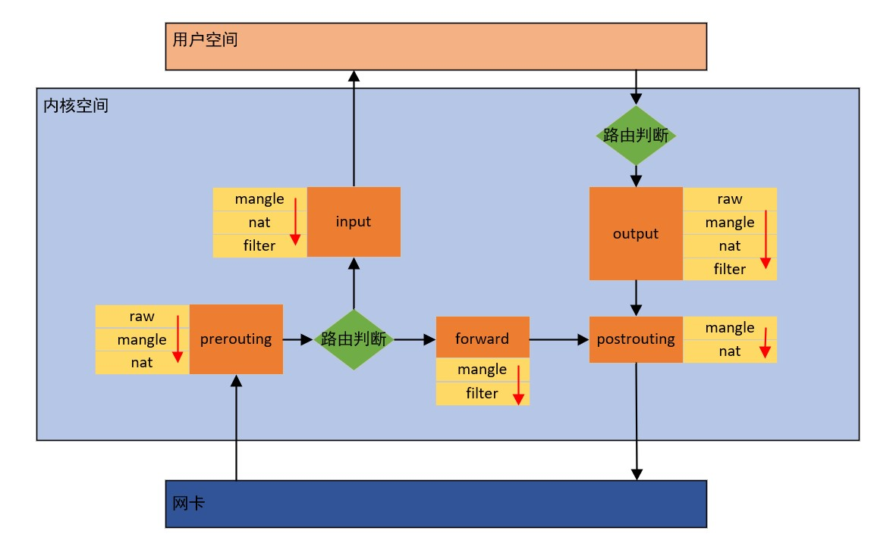

# Linux虚拟网络技术
## Network Namespace
Network Namespace是Linux内核提供的实现网络虚拟化的重要功能，他能创建多个隔离的网络空间，他们有独自的网络栈信息，运行时仿佛自己都在独立的网络中。不同的Network Namespace资源互不可见，彼此之间无法通信。

可以借助`ip netns`命令来完成对 Network Namespace 的各种操作。
## veth pair
veth pair全称是 Virtual Ethernet Pair ，是一个成对的端口，所有从这对端口的一端进入的数据包都将从另一端出来，反之也一样。

引入veth pair是为了在不同的Network Namespace之间进行通信，利用它可以直接将两个Network Namespace连接起来。
## 网桥
veth pair只能实现两个网络接口之间的通信。而网桥可以实现多个网络接口之间的通信。

网桥相关操作可以使用命令`brctl`（创建、删除和绑定）。
## iptables/netfilter
iptables是Linux实现的软件防火墙，用户可以通过iptables设置请求准入和拒绝规则。iptables相当于一个客户端代理，通过iptables将用户的安全设定写入一个安全框架中，这个安全框架才是真正的防火墙，也就是netfilter。iptables只是一个命令行工具，位于用户态。
## 消息处理链
* `INPUT` ： 进来的（从内核空间到应用层）数据包应用此规则链中的规则。
* `OUTPUT` ： 外出的（从应用层到内核空间）数据包应用此规则链中的规则。
* `FORWARD` ： 转发数据包应用此规则链中的规则。
* `PREROUTING` ： 对数据包作路由选择前应用此链中的规则（所有的数据包进来的时侯都先由这个链处理）。
* `POSTROUTING` ： 对数据包作路由选择后应用此链中的规则（所有的数据包出来的时侯都先由这个链处理）。
## 规则表
iptables是按照规则办事的，这些规则并不是存储在一张表中，而是按照功能进行分类存储在不同的表中。
* Filter：主要用来过滤数据，是最常用的表。
* NAT：用来处理网络地址转换。
* Mangle：主要用来修改IP数据包头，比如修改TTL值，同时也用于给数据包添加一些标记，从而便于后续其它模块对数据包进行处理（这里的添加标记是指往内核skb结构中添加标记，而不是往真正的IP数据包上加东西）。
* Raw：在Netfilter里面有一个叫做链接跟踪的功能，主要用来追踪所有的连接，而raw表里的rule的功能是给数据包打标记，从而控制哪些数据包不做链接跟踪处理，从而提高性能；**优先级最高**。
## 规则表和消息处理链的关系
表和链共同完成了iptables对数据包的处理。但并不是每个链都包含所有类型的表，所以，有些链是天生不具备某些功能的。

