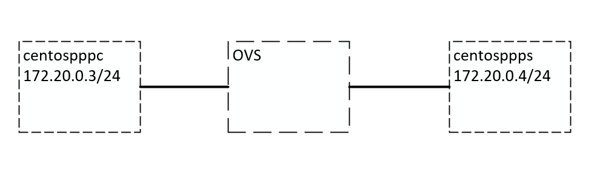
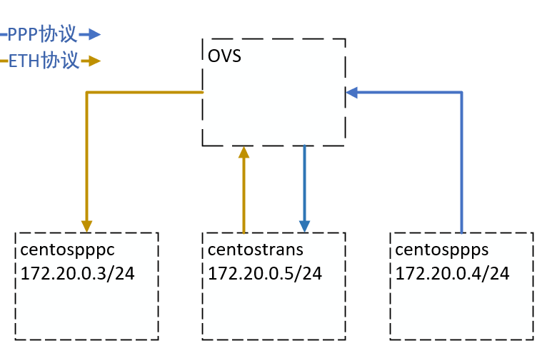

# PPP协议转以太网协议

## 实验一：验证OVS是否具有处理基于PPP协议的流量的能力

### 实验目的

验证ovs能否处理基于PPP协议的流量。

## 实验方法

1. 在虚拟机中创建两个Docker（172.20.0.3和172.20.0.4）和一个OVS，将Docker分别连接到OVS上。
2. 在其中一个Docker（172.20.0.4）上以另一个Docker（172.20.0.3）为目的构造PPP流量。
3. 在OVS上添加流表项，该流表项识别流量中目的IP为172.20.0.3，就会将流量丢弃。
4. 根据匹配情况验证OVS是否具有处理基于PPP协议的流量的能力。

### 实验环境

## 实验结论

OVS不具备识别PPP协议流量的能力，而是会将PPP协议按照以太网协议进行识别并于流表进行匹配（会将PPP协议的字段识别为以太网MAC地址）。

## 实验二：通过外挂Docker的方式进行协议转换

## 实验目的

验证能够通过在OVS外挂Docker的方式将基于PPP协议的流量转换为基于以太网协议的流量，再将转换后的以太网流量交由OVS处理并得到正确转发。

## 实验方法

1. 根据实验一的结论，因为OVS会将PPP协议按照以太网协议进行识别，而PPP协议的前六个字段分别是标志（0x7e）、地址（0xff）、控制（0x0003）、协议（0x0800），基本是确定不变的，因此将这六个字段当作MAC地址进行流表匹配。
2. 创建如下图的拓扑环境。
3. 添加流表
   * `ovs-ofctl add-flow br0 priority=10000,dl_dst=7e:ff:00:03:08:00,actions=output:"0e5ddb2d76fb4_l" `：将目标地址为7e:ff:00:03:08:00的流量转发到负责协议转换的Docker中。
   * `ovs-ofctl add-flow br0 priority=10000,nw_dst=172.20.0.3,actions=output:"d1ca0055fc434_l"`：将目标IP为172.20.0.3的以太网流量发送到对应的端口。
4. 在centostrans中启动协议转换程序。
5. 在centosppps中执行PPP协议包构造程序。
6. 在centospppc中检查能否收到数据包。

## 实验环境

## 实验结论

通过将PPP协议固定首部作为OVS中MAC地址匹配项的方式能够将PPP协议的流量转发到协议转换程序，转换后的流量能够将根据流表规则将流量正确发送到目标机器。

