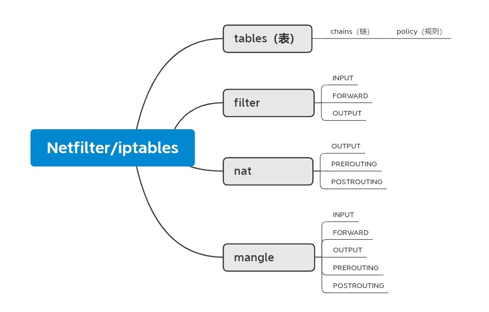

# iptables常用命令

filter：过滤本机流入和流出的数据包。

nat：网络地址转换。

mangle：对数据包进行修改。

* 查看表和链的规则信息：`iptables -t nat -nL PREROUTING`、`iptables -t nat -S POSTROUTING`。

* 查看nat表规则：`iptables -t nat -S`。
* 删除一条nat规则：`iptables -t nat -D POSTROUTING 1`
* docker 默认nat规则：`iptables -t nat -A POSTROUTING -s 172.17.0.0/16 ! -o docker0 -j MASQUERADE`（这条规则会将源地址为172.17.0.0/16的包（也就是从Docker容器产生的包），并且不是从docker0网卡发出的，进行源地址转换，转换成主机网卡的地址。）

